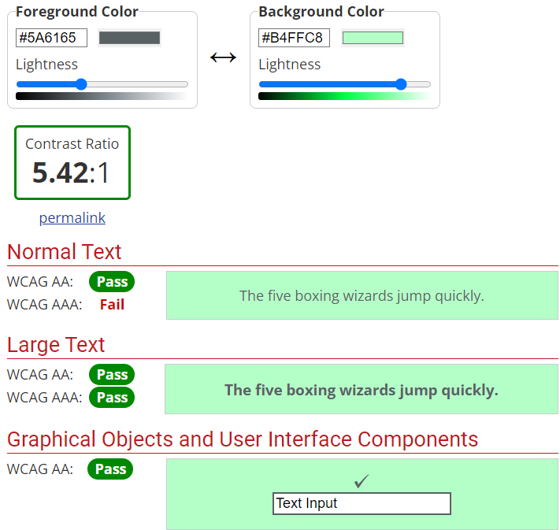
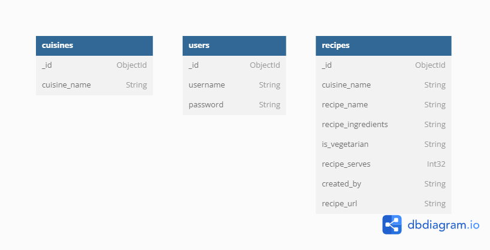
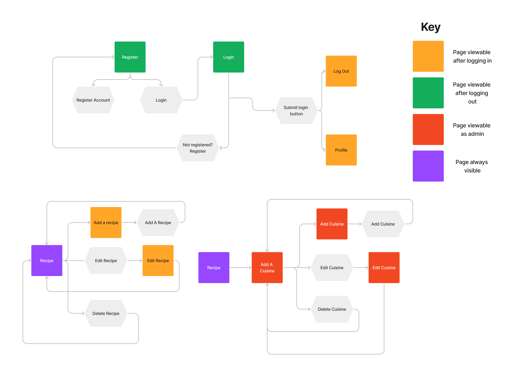

# User Experience

### Project Goals

As an avid cook myself, the idea of my project "Recipe Journal" was to provide a way to share favourite recipes with other people and also to discover new recipes to try out.

### User Stories

#### Target Audience

The target audience for Recipe Journal are avid cooks all around the world that love to share recipes with others and also discover new ones.

#### First Time Visitor Goals

1. I want to connect with like-minded individuals who are interested in cooking and discovering new recipes and cuisines.
2. I want to be able to navigate the site effectively.
3. I want to register an account.
4. I want to search for new recipes and discover new cuisines.

#### Returning Visitor Goals

1. I want to login into my account.
2. Create, edit, delete and view my recipes.

#### Admin Goals
1. I want to login as an admin.
2. Create, edit, delete and view cuisines.
3. Remove any offensive content in the recipes section.

## Features

The website is comprised of 9 pages which are extended from a base template.

* Register page
* Recipes page
* Profile page
* Login page
* Edit Recipe page
* Edit Cuisine page
* Cuisine page
* Add Recipe page
* Add cuisine page

### Existing Features

#### Colour Scheme

* The colour scheme is based on creating a simple yet intuitive atmosphere for the user.
* All colours were checked with WebAIM to assess their accessibility and ensure they present a pass.


Below is the colour scheme used for the website


#### Elements found on each page

* Navbar - The navbar is displayed on all pages of the website and allows users to navigate the website with ease without having to press the backbutton. The navbar is comprised of the site name and links to navigate the site. Depending on whether the user is logged in or not, the links will vary.

Logged out:


Loggin In:


* Footer - A footer is displayed with the websites name to compliment the navbar.

* Header - This allows the user to return back to the "Home" section where they can view all recipes submitted by various users.

#### Accessibility

I have been mindful during coding to ensure that the website if accessible and friendly. I have achieved this through:

* Using semantic HTML.
* Ensuring there is sufficient colour contrast.

# Datastructure

Recipe Journal utilises a NoSQL document-based database via MongoDB for storing recipes, user credentials and cuisines. The format and structure of these collections are illustrated below:



### User Journey



# Wireframes

# Technologies Used

### Development

* The project was written in [VSCode](https://code.visualstudio.com/)
* The project was debugged using [Google Chrome](https://www.google.com/intl/en_uk/chrome/) [Dev Tools](https://developers.google.com/web/tools/chrome-devtools).
* The project uses [GitHub](https://github.com/) for hosting source code and utilising git version control.

### Design

* The project utilised [favicon.io](https://favicon.io/favicon-converter/) to convert the Favicon to the appropriate format.

### HTML/CSS

HTML5 and CSS3 are used throughout this project.

* This project uses[Materialize CSS].(https://materializecss.com/)

### Python

* [Flask](https://flask.palletsprojects.com/en/1.1.x/) – WSGI Web Application Microframework.
* [Gunicorn](https://gunicorn.org/)
* [Jinja](https://jinja.palletsprojects.com/en/2.11.x/) for templating HTML via Python.
* For a more detailed list of the packages' dependencies please see the requirements.txt.

This project uses JavaScript ES6.

* [Materialize CSS](https://github.com/materializecss/materialize) – In-built JavaScript package for interactive and responsive web-design.
* [JQuery](https://jquery.com/)

# Testing

# Deployment

This project was deployed to Heroku via the following steps:

### Initial Deployment

- Navigate to [Heroku](https://www.heroku.com/).
- [Log in](https://id.heroku.com/login) or [Sign Up](https://signup.heroku.com/) for an account.
  - If Creating an account, select **Python** as the Primary development language.
  - Activate the account via the confirmation email.
  - Accept the Terms of Service.
- Click on **Create new app**.
- Enter a suitable **App Name** and **Region**.
- Click **Create App**.
- Under the **Deploy** tab, under the heading **Deployment Method**, click the **GitHub** icon, and proceed to click the button which states **Connect to GitHub**.
- Enter your credentials for **GitHub.**
- Search for the repository required (in this instance, **Recipe-Journal-CI**), and click **Connect.**

### Automatic Deployment

This project was set up to automatically re-deploy with any changes made to the Master Branch. The following steps were taken to enable this.

- Navigate to the **Automatic deploys** section within the **Deploy** tab.
- Select the **branch** you would like to link to automatic deployment.
- Click **Enable Automatic Deploys**.

### Environment Variables

The following environment variables must be set within your Heroku Server for the site to deploy and function correctly. Navigate to the **Settings** tab, and under the heading **Config Vars**, select **Reveal Config Vars,** and add the following variables:

- **IP** : 0.0.0.0
- **PORT** : 5000
- **MONGO_URI**
  - This variable can be obtained from **MongoDB** through the following steps:
  - Log in to [MongoDB](https://www.mongodb.com/2).
  - Under **Data Storage** click on **Clusters**.
  - For the Cluster that you would like to connect to, click the **Connect** button.
  - Click on **Connect your Application.**
  - Select **Python**, and Version **3.6 or Later.**
  - Copy the connection string, replacing `<password>` with your MongoDB password, and `myFirstDatabase` with the name of the **MongoDB Collection** (Database) you would like to connect to.
- **MONGO_DBNAME**
  - The name of the Database you are connecting to (in the above example, the default would be `myFirstDatabase`.)
- **SECRET_KEY**
  - A random sequence of characters, required for maintaining session security in Flask. One method of obtaining a Secret Key is through [RandomKeygen](https://randomkeygen.com/).

  ### Environment Variables

- When running this project locally, the **Environment Variables** must be set in order for it to function as intended.
- Once you have completed any of the upcoming steps to run/deploy the project in your browser or locally, please create a new python file in your root directory called [**envy.py**](https://pypi.org/project/env.py/).
- Within this file, declare the environment variables described above, in the following format, replacing the `<variable>` with the required variables:


- "```python"
- import os

- os.environ.setdefault("IP", "<variable>")
- os.environ.setdefault("PORT", "<variable>")
- os.environ.setdefault("SECRET_KEY", "<variable>")
- os.environ.setdefault("MONGO_URI", "<variable>")
- os.environ.setdefault("MONGO_DBNAME", "<variable>")

The project will automatically locate this file, and read the required environment variables as and when necessary. This file has not been included within the repo due to the security implications.

### Running this project in your Browser

1. Install [Google Chrome](https://www.google.co.uk/chrome/) or [Firefox](https://www.mozilla.org/en-GB/exp/firefox/new/) .
2. Install the applicable [GitPod](https://www.gitpod.io/docs/browser-extension/) Browser Extensions for your chosen browser.
3. Create a [GitHub](https://github.com/join) account.
4. Log in to [Gitpod](https://gitpod.io/login/) using your GitHub account.
5. Visit **Recipe-Journal-CI** [GitHub Repository](https://github.com/tomes2000/Recipe-Journal-CI).
6. To run the `main` branch, ensure the `main` branch is selected next to the **branches** and **tags** subheadings. 
7. Open the repository in Gitpod:
8. Click the green "Gitpod" icon at the top of the Repository, or
9. A new workspace will open with the current state of the requested branch. Any changes made to the requested branch after this point will not be automatically updated in your Gitpod Workspace.
10. Create the aforementioned env.py file in your root directory and declare the environment variables.
11. Type `pip install requirements.txt` into the GitPod terminal to install all the required Python packages.
12. To host the project from Gitpod, type `python flask_app.py` in the terminal.

### Running this project locally

#### Cloning the Repository

1. Visit **Recipe-Journal-CI** [GitHub Repository](https://github.com/tomes2000/Recipe-Journal-CI).
2. Click the "Code" dropdown box above the repository’s file explorer.
3. Under the "Clone" heading, click the "HTTPS" sub-heading.
4. Click the clipboard icon, or manually copy the text presented: `https://github.com/tomes2000/Recipe-Journal-CI`
5. Open your preferred IDE (VSCode, Atom, PyCharm, etc).
6. Ensure your IDE has support for Git, or has the relevant Git extension.
7. Open the terminal, and create a directory where you would like the Repository to be stored.
8. Type git clone and paste the previously copied text (`https://github.com/tomes2000/Recipe-Journal-CI`) and press enter.
   - If you would like to clone only the dev branch, please type git clone -b dev before the previously copied link to the repository.
9. The Repository will then be cloned to your selected directory.

#### Manually Downloading the Repository

1. Visit **Recipe-Journal-CI's** [GitHub Repository](https://github.com/tomes2000/Recipe-Journal-CI).
   - Ensure you have selected the appropriate branch, as previously discussed.
2. Click the "Code" dropdown box above the repository’s file explorer.
3. Click the "Download ZIP" option; this will download a copy of the selected branch’s repository as a zip file.
4. Locate the ZIP file downloaded to your computer, and extract the ZIP to a designated folder which you would like the repository to be stored.

#### Opening the Repository

1. Open your preferred IDE (VSCode, Atom, PyCharm, etc).
2. Navigate to the chosen directory where the Repository was Cloned/Extracted.
3. **Optional:** Create a new Python [Virtual Environment](https://docs.python.org/3/tutorial/venv.html)
4. Type `pip install requirements.txt` to install all the required packages.
5. Type `python app.py` in the terminal, whilst in the project’s root directory.
6. You will now be hosting the repository from your IDE.
